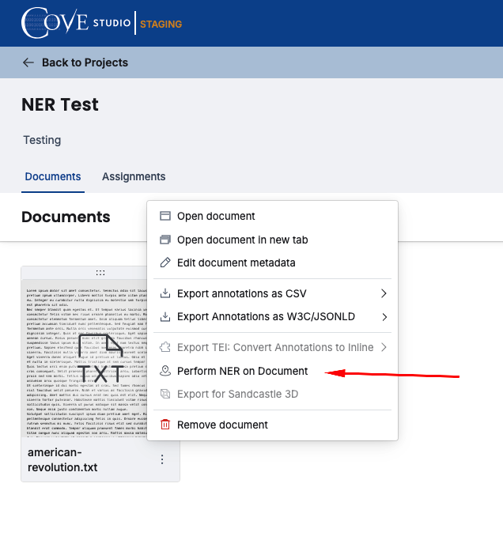

# ner-plugin

This [Recogito Studio](https://recogitostudio.org/) (RS) plugin adds the ability to perform Named Entity Recognition (NER) on plain text and TEI documents. This plugin adds a new option to the document card menu on the project home page:



A document must either be public or owned by you in RS for you to be able to perform this operation. Once selected you ae presented with options to configure the name of the NER'ed document, which NER model to use, and the language of the document.


Once the NER is completed, a new document is added to your project which contains the named entities as read-only annotations. In the case of a plain text document, the produced document is encoded in [TEI](https://www.tei-c.org/) with the annotations added as a standoff element which can be interpreted by RS. A TEI document which has NER performed will return a new TEI document with a new standoff element containing the NER annotations.

## Trigger.dev job runner

NER can be a long running operation, so this plugin makes use of [Trigger.dev](https://trigger.dev/) background job runner. While it is easiest to use the cloud based service, trigger.dev can be self-hosted. Please see [the documentation](https://trigger.dev/docs/open-source-self-hosting) for guidance on self-hosting.

### Required ENV variables for Trigger.dev

Whether using the cloud service or self-hosting, the plugin requires that the following ENV are set on the deployed trigger.dev project. Note that this uses the example [Stanford CoreNLP Services](https://stanfordnlp.github.io/CoreNLP/) which is detailed below.

```
CORENLP_URL_EN=<url of CoreNLP English service>
CORENLP_URL_DE=<url of CoreNLP German service>
```

## Example NER services

The repository contains an example [docker-compose](./docker-compose.corenlp.yml) YML file that deploys an English and German NLP services. These feature fairly comprehensive NER capabilities.

## Configuring Additional NER services

To add additional NER service endpoints requires the following steps:

### 1. Update NER options in NERMenuExtension.tsx

[NERMenuExtension.tsx](./src/components/NERMenuExtension.tsx) contains the `NEROptions` object.

```
  const NEROptions: { value: string; label: string }[] = [
    { value: 'stanford-core', label: t['Stanford Core NLP'] },
  ];
```

It is currently configured to only offer the `Stanford Core NLP` service. Add new values and labels to include additional NER services.

### 2. Create new Trigger tasks

The top level [stanfordCore.ts](./src/trigger/stanfordCore.ts) task calls the sub-tasks that implement the NER pipeline. For a new endpoint, you would implement a new task using `stanfordCore.ts` as a template. The basic set of steps here are:

1. Create a Supabase client
2. Download the file for NER from Supabase
3. Convert to plain text. There are two different subtasks that handle this based on wether the file is text or TEI XML:

- [xmlToPlainText.ts](./src/trigger/tasks/xmlToPlainText.ts)
- [plainTextToXML.ts](./src/trigger/tasks/plainTextToXML.ts)

4. Call your new endpoint task. How this task functions will depend on how the endpoint functions but the important requirement is that your new task returns the same structure as the example [doStanfordNlp.ts](./src/trigger/tasks/doStandfordNlp.ts) task [NERResults](./src/trigger/types.ts).

```
export type TagTypes =
  | 'persName'
  | 'orgName'
  | 'placeName'
  | 'settlement'
  | 'country'
  | 'region'
  | 'date';
export type NEREntry = {
  text: string;
  startIndex: number;
  endIndex: number;
  localizedTag: string;
  inlineTag: TagTypes;
  attributes?: { [key: string]: string };
};
export type NERResults = {
  entries: NEREntry[];
};
```

### 3. Update the NERAgentRoute API endpoint

The [NERAgentEndpoint.ts](./src/api/NERAgentRoute.ts) file receives the options from the configuration dialog. To handle your new options, update this block of code and trigger your new top level task:

```
  if (body.model === 'stanford-core') {
    handle = await stanfordCore.trigger({
      projectId: projectId as string,
      documentId: documentId as string,
      language: body.language,
      token: body.token,
      key: supabaseAPIKey,
      serverURL: supabaseServerUrl,
      nameOut: body.nameOut,
      outputLanguage: body.outputLanguage,
    });
  }
```

i.e.:

```
  if (body.model === 'stanford-core') {
    handle = await stanfordCore.trigger({
      projectId: projectId as string,
      documentId: documentId as string,
      language: body.language,
      token: body.token,
      key: supabaseAPIKey,
      serverURL: supabaseServerUrl,
      nameOut: body.nameOut,
      outputLanguage: body.outputLanguage,
    });
  } else if(body.model === 'may-new-ner-service`) {
    handle  = await myNewNERService.trigger({
      projectId: projectId as string,
      documentId: documentId as string,
      language: body.language,
      token: body.token,
      key: supabaseAPIKey,
      serverURL: supabaseServerUrl,
      nameOut: body.nameOut,
      outputLanguage: body.outputLanguage,
    });
  }
```

### 4. Rebuild and update the tasks on Trigger.dev

Whether your are using the cloud service or self hosting, the procedure is the same:

```
npm run build
npx trigger.dev@latest deploy -c ./src/trigger.config.ts
```

The trigger deploy task will use your configuration set in `/src/trigger.config.ts`
